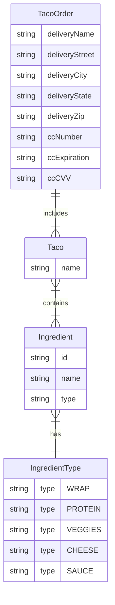

# spring-in-action
Learning Spring Basics

Figure 2.2 The Taco Cloud Domain Entity Relationship Diagram

```mermaid
erDiagram
    TacoOrder {
        string deliveryName
        string deliveryStreet
        string deliveryCity
        string deliveryState
        string deliveryZip
        string ccNumber
        string ccExpiration
        string ccCVV
    }
    Taco {
        string name
    }
    Ingredient {
        string id
        string name
        string type
    }
    IngredientType {
        string type "WRAP"
        string type "PROTEIN"
        string type "VEGGIES"
        string type "CHEESE"
        string type "SAUCE"
    }
    
    TacoOrder ||--|{ Taco: includes
    Taco }|--|{ Ingredient: contains
    Ingredient }|--|| IngredientType: has

```

>> Note:  
O| - Zero or one  
|| - One and only one  
O{ - Zero or many  
|{ - One or many