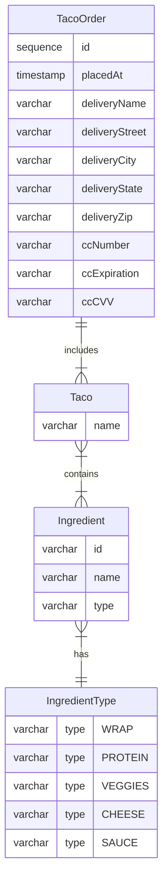
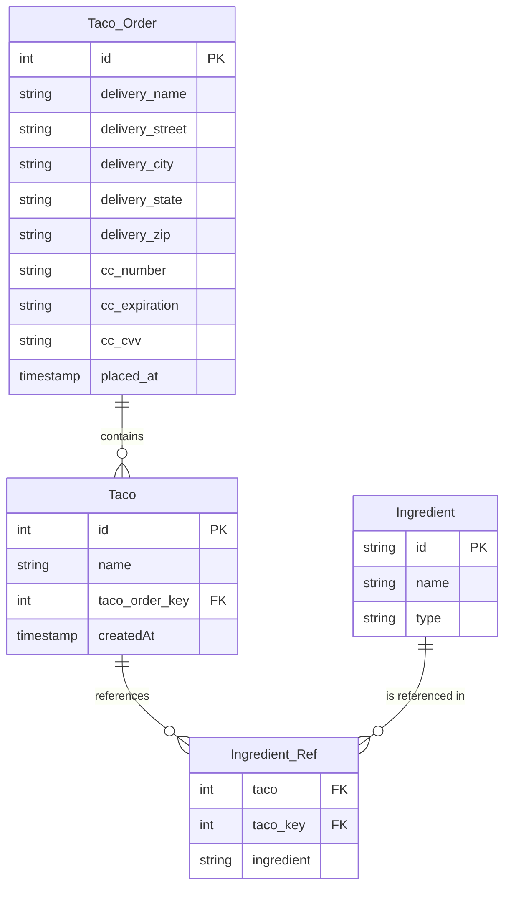

# spring-in-action
Learning Spring Basics

Figure 2.2 The Taco Cloud Domain Entity Relationship Diagram

>> Note:  
O| - Zero or one  
|| - One and only one  
O{ - Zero or many  
|{ - One or many

As Spring Data JDBC does not support many-to-many relationships, the Ingredient_Ref 
table is used to represent the many-to-many relationship between Taco and Ingredient.

As Spring Data automatically creates implementations of the Repository interfaces, 
we don't need the implementation classes anymore. If we use CrudRepository, in 
that case we don't even need to declare the basic operations in the interface. 
In case we extend from Repository, then we had to mention(declare) the methods to 
find, save and update data.

We’ll need to annotate our domain classes so that Spring
Data JDBC will know how to persist them. Generally speaking, this means annotating
the identity properties with @Id—so that Spring Data will know which field represents
the object’s identity—and optionally annotating the class with @Table.