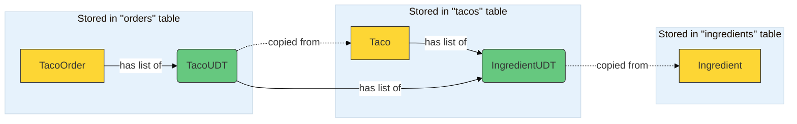

# Spring in Action 6 Chapter 4 - Working with nonrelational data
## Using NoSQL with Spring Data Cassandra

### Setting up a docker container for cassandra:
- Create a docker network for cassandra container 
```shell
docker network create cassandra-net
```
- Create a docker container running cassandra using that network
```shell
docker run --name my-cassandra --network cassandra-net -p 9042:9042 -d cassandra:latest
```
- Login to CQL(Cassandra Query Language) shell inside the container
```shell
docker run -it --network cassandra-net --rm cassandra cqlsh my-cassandra
```
- Create a keyspace for taco-cloud database
```shell
CREATE KEYSPACE taco_cloud WITH REPLICATION = {'class':'SimpleStrategy', 'replication_factor':1} AND DURABLE_WRITES = true;
```
- Exit out of the CQL Shell
```shell
exit
```
