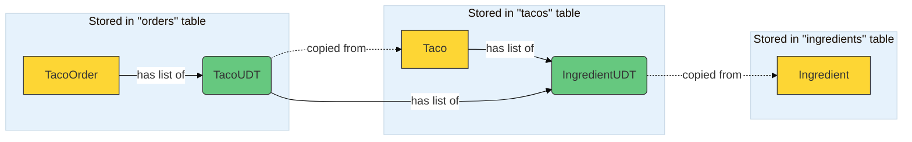

# Spring in Action 6 Chapter 4 - Working with nonrelational data
## Using NoSQL with Spring Data MongoDB

### Setting up a docker container for cassandra:
- Create a docker network for mongodb container 
```shell
docker network create mongo-net
```
- Create a docker container running cassandra using that network. The flag `--wiredTigerCacheSizeGB 1.5` is optional if you want to limit the size of the cache to 1.5 GB or whatever size you prefer.
```shell
docker run -d --name mongodb --network mongo-net -e MONGO_INITDB_ROOT_USERNAME=test -e MONGO_INITDB_ROOT_PASSWORD=test -p 27017:17017 mongo:latest --wiredTigerCacheSizeGB 1.5
```
- Login to CQL(Cassandra Query Language) shell inside the container
```shell
docker run -it --network cassandra-net --rm cassandra cqlsh my-cassandra
```
- Create a keyspace for taco-cloud database
```shell
CREATE KEYSPACE taco_cloud WITH REPLICATION = {'class':'SimpleStrategy', 'replication_factor':1} AND DURABLE_WRITES = true;
```
- Exit out of the CQL Shell
```shell
exit
```
